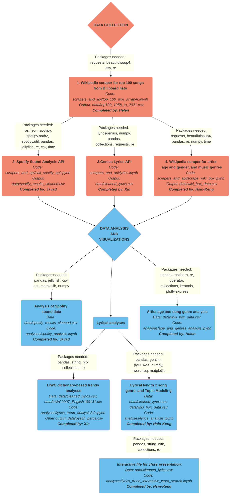

## final-project-cool-team-name

#  Analyzing Billboard Top 100 songs from 1958-2021 

Project team members: Javad Eshtiyagh, Hsin-Keng Ling, Xin Tang, Helen Yap

## Presentations and recording:
### A UChicago Gmail account is needed to access the following files in Google Drive:
* Link to slides used for the in-class presentation: https://docs.google.com/presentation/d/1-I7DKqXtPXg-dSrhMvKKtigIw_6YtwA_nsy438v-qEo/edit?usp=sharing
* Link to slides for recorded coding presentation: https://docs.google.com/presentation/d/14yjbaqB5Fz52V5ITdfIIypd8MPrJFzGLY6k48txJpc0/edit?usp=sharing
* Link to recorded coding presentation: https://drive.google.com/file/d/1r9h0QgFRAmuXRzAgjIs4htMJllqxW2j4/view?usp=sharing


## Description and instructions:
Please follow the workflow depicted in the diagram below to emulate our project. The specific versions of the packages required are listed below the diagram. All the associated files are listed with each step of the pipeline and the folder structure is laid out below the workflow diagram. 

All coding was done in Jupyter Notebooks. Aside for the "wiki_box_scraper.ipynb," in order to re-run our code, download our files, all specified packages, and use the "Run All" command available in Jupyter Notebook. 

To run the "wiki_box_scraper.ipynb," please note the section of "Manual Scraping Pipeline." Due to the nature of the associations between artists and bands, there are a few Wikipedia pages that will end up in a recursive web crawling loop. To override this challenge, Hsin-Keng has to manually stop the kernel and then reset the starting index in the range.


## Workflow


## Required packages and versions if available (listed alphabetically)
* ast 3.10.2
* beautifulsoup4 4.10.0 
* collections
* gensim 4.1.2
* jellyfish 0.9.0
* lyricsgenius 3.0.1
* matplotlib 3.4.3
* nltk 3.6.5
* numpy 1.21.5
* pandas 1.3.5
* plotly 5.6.0
* pyLDAvis
* re 2.2.1
* regex 2021.8.3
* requests 2.27.1
* seaborn 0.11.2
* spotipy 2.19.0
* string
* wordfreq 3.0.0


## Project folders
```bash
├── analyses
│   └── age_and_genres_analysis.ipynb
│   └── lyrics_analysis.ipynb
│   └── lyrics_trend_analysis3.0.ipynb
│   └── lyrics_trend_interactive_word_search.ipynb
│   └── spotify_analysis.ipynb
├── data
│   └── LIWC2007_English100131.dic
│   └── cleaned_lyrics.csv
│   └── psych_percs.csv
│   └── spotify_results.csv
│   └── spotify_results_cleaned.csv
│   └── top100_1958_to_2021.csv
│   └── top_100_with_lyrics.csv
│   └── wiki_box_data.csv
├── scrapers_and_api
│   └── call_spotify_api.ipynb
│   └── scrape_wiki_box.ipynb
│   └── lyrics.ipynb
│   └── top_100_wiki_scraper.ipynb
├── README.md

```
